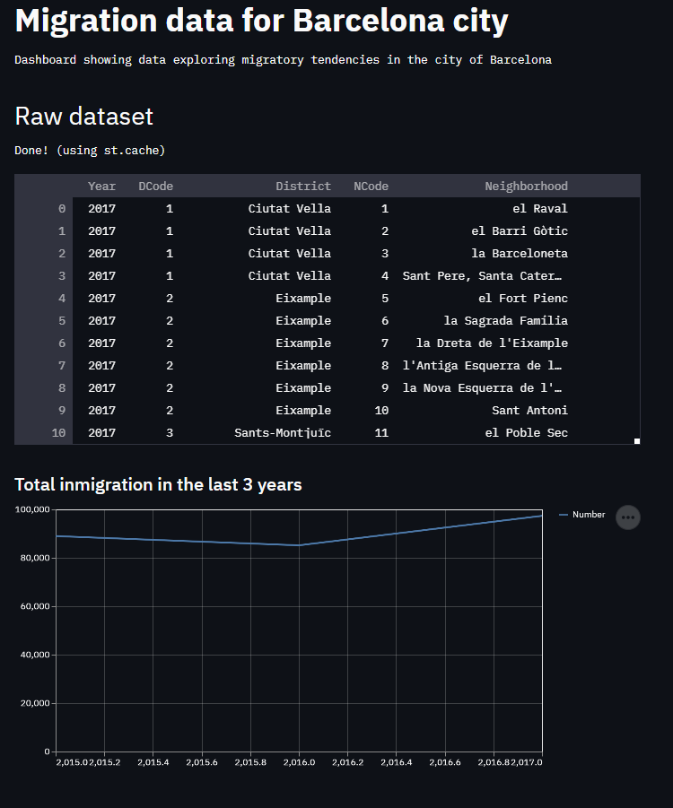
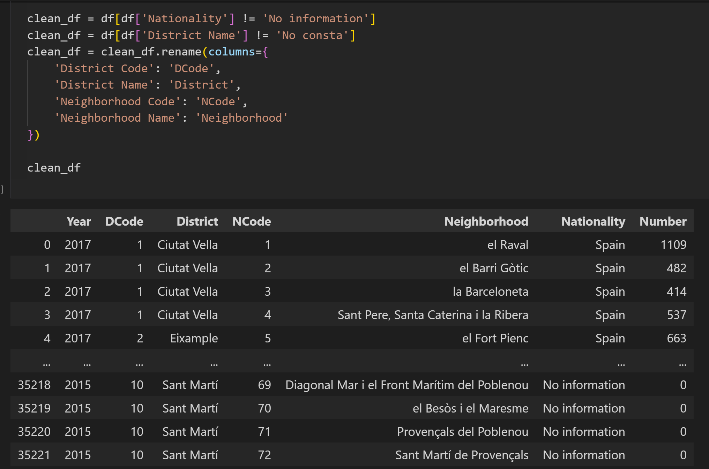
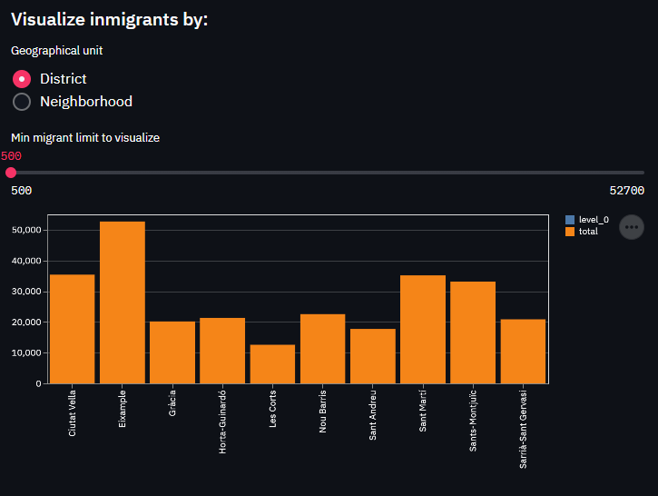
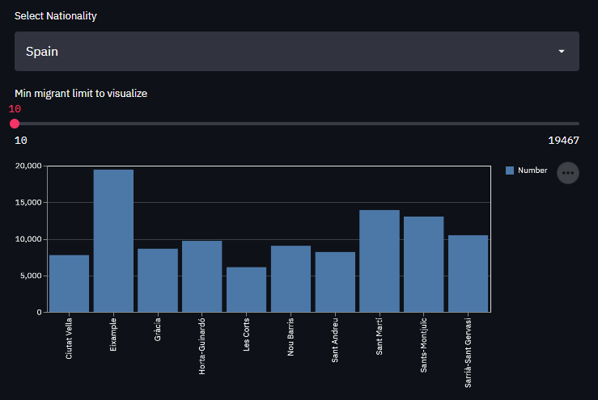

### Data Vizualisation Project
# Migration Patterns in Barcelona

## Description

This project uses a server in [Flask](https://flask.palletsprojects.com/en/2.0.x/) to provide an api to a dashboard made in [streamlit](https://streamlit.io/).
The database is stores in the cloud with [Mongo Atlas](https://www.mongodb.com/cloud/atlas)

## Dataset

The dataset used in this project is:

[Open Data BCN](https://www.kaggle.com/xvivancos/barcelona-data-sets)

Mainly the [Inmigrants by nationality](https://www.kaggle.com/xvivancos/barcelona-data-sets?select=immigrants_by_nationality.csv) dataset.

## Dependencies

This project was developed in [Python](https://www.python.org/). Other technologies used include:
* [Pandas](https://pandas.pydata.org/docs/index.html)
* [numpy](https://numpy.org/)
* [Jupyter notebook](https://jupyter.org/)

## Data cleaning

The raw dataset was explored and cleaned, manly discarding the rows with either 'null' values or 'No information' in the desired column.

The process can be reviewed in the `inmigration_data` jupyter notebook in this repository.

## Dashboard

The streamlit dashboard provides the user with a general view of the raw data and a bar chart with the general tendency of number of 
inmigrants to Barcelona in the last 3 years (as far as the dataset allows)

Several user interactions allow the user to visualize the amount of inmigrants per the geographic division of their choosing:

* 'Districts' or 'Neighborhoods'

A slider allows to limit the visuals to a minimum amount of migrante (e.g. hiding the districts with less than 100 migrants)
Aditionally, the user can explore the nationality of the respective migrants in each unit (as filtered before),

## Todo/WIP

* Deploy the app in the web. Use of Docker.
* Refactor/decoupling of code in diferent modules
* Enrichment of dataset and multipage dashboard

## Author
Simon Garmendia 

## License

This project is licensed under the MIT License - see the LICENSE.md file for details
